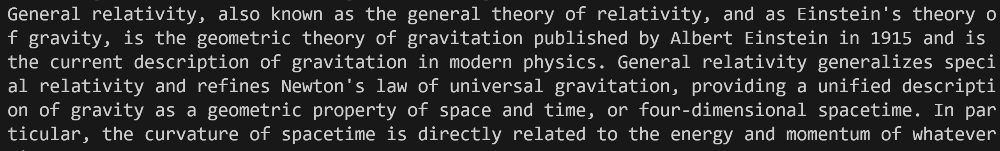

# 📖 Wikipedia Agent

> Author: Ruslan Magana Vsevolodovna
> A minimal Go-based MCP agent that exposes a `fetch_wikipedia_summary` tool, powered by the public Wikipedia REST API.

[](https://www.google.com/search?q=)
[](https://www.google.com/search?q=)

-----

## Features

  - Implements the **`fetch_wikipedia_summary`** MCP tool
  - Queries the public Wikipedia REST API (no key required)
  - HTTP (JSON-RPC 2.0) transport at `/`
  - **Health** (`/health`) and **Version** (`/version`) endpoints
  - Single static binary (\~2 MiB)
  - Dockerfile for a lightweight, secure container
  - Unit tests with mocked HTTP responses
  - Makefile for build, test, lint, and Docker targets

-----

## Quick Start

```bash
git clone https://github.com/mcp-forge/wikipedia-agent.git
cd wikipedia-agent

# Build the binary
make build

# Run locally on port 8080
make run
```

-----

## Installation

Requires Go 1.23+:

```bash
go install github.com/mcp-forge/wikipedia-agent@latest
```

-----

## Configuration

The agent is designed to work out-of-the-box with no required configuration. You can optionally override default settings with flags:

```bash
wikipedia-agent -listen=0.0.0.0 -port=8080 -lang=de
```

  - `-listen` (default `0.0.0.0`): Network interface to bind.
  - `-port` (default `8080`): Port to listen on.
  - `-lang` (default `en`): Wikipedia language code to query (e.g., `es`, `fr`, `de`).
  - `-help`: Show usage.

-----

## API Reference

### Health Check

**GET** `/health`

```bash
curl http://localhost:8080/health
# → {"status":"ok"}
```

### Version Info

**GET** `/version`

```bash
curl http://localhost:8080/version
# → {"name":"wikipedia-agent","version":"0.1.0"}
```

### Fetch a Wikipedia Summary

**POST** `/lookup`
Content-Type: `text/plain`

The request body should contain the plain text topic you want to look up.

**Example Request (using `curl`):**

```bash
curl -X POST \
  -H "Content-Type: text/plain" \
  -d "General relativity" \
  http://localhost:8080/lookup
```

**Example Response:**

The server will respond with the plain text summary of the Wikipedia article directly in the response body.

```text
General relativity, also known as the general theory of relativity and Einstein's theory of gravity, is the geometric theory of gravitation published by Albert Einstein in 1915 and is the current description of gravitation in modern physics...
```

-----

## Docker

Build and run a containerized version of the agent using the Makefile.

```bash
make docker-build
make docker-run
```

Under the hood, this runs the following standard Docker commands:

```bash
docker build -t wikipedia-agent:latest .
docker run --rm -p 8080:8080 wikipedia-agent:latest
```

```bash
bash test.sh
```


-----

## Makefile Targets

| Target              | Description                                   |
| ------------------- | --------------------------------------------- |
| `make help`         | Show this help summary                        |
| `make build`        | Compile the binary into `dist/`               |
| `make run`          | Build & run locally on port 8080              |
| `make test`         | Run unit tests                                |
| `make coverage`     | Generate an HTML test coverage report         |
| `make lint`         | Run `golangci-lint`                           |
| `make tidy`         | Run `go mod tidy` + `go mod verify`           |
| `make docker-build` | Build the Docker image                        |
| `make docker-run`   | Run the Docker container on port 8080         |
| `make clean`        | Remove build & coverage artifacts             |

-----

## Testing & Coverage

Easily run the full suite of tests and view coverage reports.

```bash
# Run all unit tests
make test

# Generate an HTML coverage report in dist/coverage.html
make coverage
```